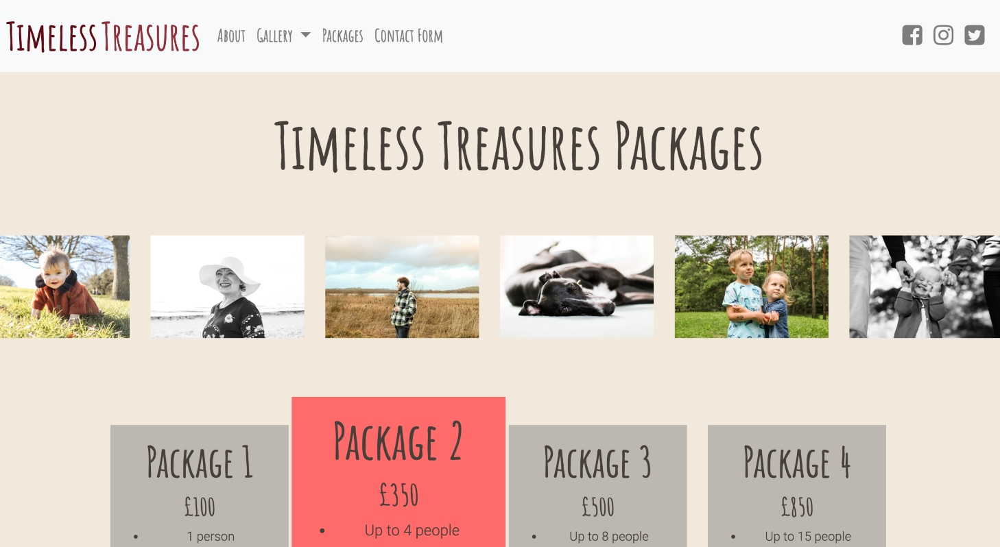
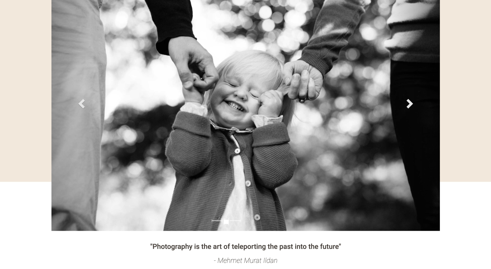

# Timeless-Treasure-WebApp

# **Project Description**

The final Sky project entailed the design of a web application that utilized front-end and back-end programming languages. 
My team and I developed a responsive web application for a photography service that allows users to view our services and packages, 
use a quote calculator to receive a quote, and use a contact form to submit queries or request tailored services.

We have connected our contact form to a MySQL database and also rendered the data to an HTML page for secure access.

# **Technologies Used**
➖ Python 3  
➖ MySQL   
➖ HTML  
➖ CSS  
➖ Flask  
➖ JavaScript  
➖ Bootstrap  

# **ScreenShot**  

**Service page**  

**Get a quote**  

**Gallery page**  

**Home - image carousel**  

**Contact page that connects to DB**  

# **Authors:**
[Jessie](https://github.com/KingJessie)  
[Gabby](https://github.com/gab-bernotaite)  
[Claudia-Jade](https://github.com/Claudia-Jade)  
[Uzma](https://github.com/uzmaazhar786)  
[Amba](https://github.com)  

# License and Copyright 
© Timeless-Treasure

